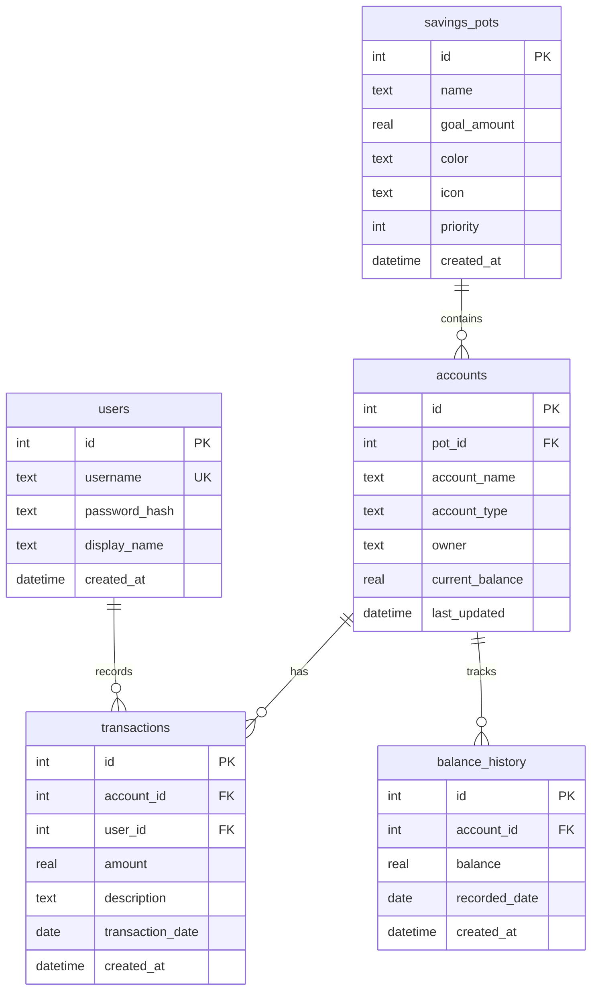

# SavinGCs 💰🏡

[](https://nextjs.org/)
[](https://www.typescriptlang.org/)
[](https://reactjs.org/)
[](https://opensource.org/licenses/MIT)

A beautiful, mobile-first savings tracking application for couples saving towards shared goals — like a house deposit. Track multiple savings pots, manage accounts across banks, and visualise your progress with animated dashboards.

## ✨ Features

- 📊 **Dashboard** — Total savings overview with animated progress bars and goal tracking
- 💰 **Savings Pots** — Organise savings by goal (House, Emergency, Holiday, etc.)
- 🏦 **Multi-Account** — Track accounts across different banks within each pot
- 📝 **Transaction History** — Full ledger with sortable, filterable views
- 📈 **Net Worth Chart** — Historical balance tracking over time
- 💸 **Fund Allocation** — Move and allocate funds between pots
- 📤 **CSV Export** — Export transaction data for spreadsheet analysis
- 🔐 **Authentication** — Secure login with bcrypt password hashing
- 📱 **Mobile-First** — Optimised for iPhone with 48px touch targets and bottom tab navigation
- 🎨 **Premium Design** — Custom design system with emerald/amber palette, shimmer animations, and glassmorphism

## 🚀 Quick Start

```bash
git clone https://github.com/your-username/SavinGCs.git
cd SavinGCs
npm install
npm run dev
```

Open [http://localhost:3000](http://localhost:3000) and log in with the default credentials.

## 📋 Prerequisites

- [Node.js](https://nodejs.org/) 18.0 or higher
- npm 9.0+ (included with Node.js)

## 🔧 Installation

### From Source

```bash
# Clone the repository
git clone https://github.com/your-username/SavinGCs.git
cd SavinGCs

# Install dependencies
npm install

# Create environment file
cp .env.local.example .env.local
# Edit .env.local with your database credentials

# Start development server
npm run dev
```

### Environment Variables

Create a `.env.local` file in the project root:

| Variable | Description | Required |
|----------|-------------|----------|
| `TURSO_DATABASE_URL` | Turso database URL | Yes (production) |
| `TURSO_AUTH_TOKEN` | Turso auth token | Yes (production) |
| `DEFAULT_PASSWORD` | Default password for initial users | Yes (for first-time setup) |
| `NODE_ENV` | Environment (`development` / `production`) | No |

> [!NOTE]
> For local development, the app falls back to a local SQLite file (`savings-tracker.db`) if Turso credentials are not set.

## 📖 Usage

## 📖 Usage

### Default Credentials

| User | Username | Password | Display Name |
|------|----------|----------|--------------|
| 1 | `gary` | *Value of `DEFAULT_PASSWORD`* | Gary |
| 2 | `catherine` | *Value of `DEFAULT_PASSWORD`* | Catherine |

> [!NOTE]
> `DEFAULT_PASSWORD` must be set in your environment variables for initial user creation.

> [!CAUTION]
> Change these passwords immediately after initial setup in any production deployment!

### Getting Started

1. **Login** — Use the default credentials above
2. **Create Pots** — Go to Settings → Add pots like "House Deposit" with a goal amount
3. **Add Accounts** — Go to Accounts → Link your bank accounts to pots
4. **Record Balances** — Tap the **£** button to update account balances
5. **Track Progress** — Return to Home to see your dashboard with progress bars

### Navigation

The app uses a mobile-style bottom tab bar:

| Tab | Description |
|-----|-------------|
| 🏠 **Home** | Dashboard with savings overview and progress |
| 💳 **Accounts** | Manage bank accounts and view balances |
| 🕐 **History** | Transaction history with CSV export |
| ⚙️ **Settings** | Create and manage savings pots |
| **£** (centre) | Quick-access balance update form |

## 🏗️ Architecture

### Tech Stack

| Layer | Technology |
|-------|-----------|
| **Framework** | Next.js 14 (App Router) |
| **Language** | TypeScript |
| **UI** | React 18 |
| **Styling** | Custom CSS design system (no Tailwind) |
| **Database** | LibSQL / [Turso](https://turso.tech/) (Local file or Cloud) |
| **Auth** | bcrypt password hashing + session cookies |
| **Export** | Papa Parse (CSV generation) |
| **Deployment** | Docker / Cloud Run / Vercel |

### Design System

- **Aesthetic** — "Financial Clarity with Warmth"
- **Fonts** — Manrope (display), DM Sans (body), JetBrains Mono (numbers)
- **Colours** — Emerald `#059669` (growth), Amber `#f59e0b` (achievements)
- **Style** — Spacious layout, rounded corners, shimmer animations

### Project Structure

```
SavinGCs/
├── app/
│   ├── api/                    # REST API routes
│   │   ├── auth/               #   Login & session management
│   │   ├── pots/               #   Savings pots CRUD
│   │   ├── accounts/           #   Accounts CRUD
│   │   ├── transactions/       #   Transaction ledger
│   │   ├── allocate/           #   Fund allocation
│   │   └── export/             #   CSV export
│   ├── layout.tsx              # Root layout
│   ├── page.tsx                # Main SPA entry point
│   └── globals.css             # Design system & styles
├── components/
│   ├── Dashboard.tsx           # Home dashboard with progress bars
│   ├── Login.tsx               # Authentication form
│   ├── ManagePots.tsx          # Create/edit savings pots
│   ├── ManageAccounts.tsx      # Create/edit bank accounts
│   ├── AccountDetail.tsx       # Account detail bottom sheet
│   ├── AllocateFunds.tsx       # Fund allocation between pots
│   ├── UpdateBalanceForm.tsx   # Quick balance update modal
│   ├── TransactionForm.tsx     # Add new transactions
│   ├── SpreadsheetView.tsx     # Transaction table with export
│   └── NetWorthChart.tsx       # Historical balance chart
├── lib/
│   ├── db.ts                   # Local SQLite connection
│   ├── db_turso.ts             # Turso (production) database layer
│   └── schema.sql              # Database schema
├── Dockerfile                  # Multi-stage Docker build
├── package.json
└── tsconfig.json
```

### Database Schema



## 📡 API Reference

### Authentication

| Method | Endpoint | Description |
|--------|----------|-------------|
| `POST` | `/api/auth/login` | Login with username/password |
| `GET` | `/api/auth/session` | Check current session |
| `POST` | `/api/auth/session` | Logout (destroy session) |

### Savings Pots

| Method | Endpoint | Description |
|--------|----------|-------------|
| `GET` | `/api/pots` | List all pots with calculated totals |
| `POST` | `/api/pots` | Create a new savings pot |
| `PATCH` | `/api/pots/[id]` | Update a pot |
| `DELETE` | `/api/pots/[id]` | Delete a pot (cascades to accounts) |

### Accounts

| Method | Endpoint | Description |
|--------|----------|-------------|
| `GET` | `/api/accounts` | List all accounts |
| `POST` | `/api/accounts` | Create a new account |
| `PATCH` | `/api/accounts/[id]` | Update an account |
| `DELETE` | `/api/accounts/[id]` | Delete an account (cascades to transactions) |

### Transactions

| Method | Endpoint | Description |
|--------|----------|-------------|
| `GET` | `/api/transactions` | List transactions (with filters) |
| `POST` | `/api/transactions` | Add a transaction (auto-updates balance) |
| `DELETE` | `/api/transactions/[id]` | Delete a transaction (reverses balance) |

### Other

| Method | Endpoint | Description |
|--------|----------|-------------|
| `POST` | `/api/allocate` | Allocate funds between pots |
| `GET` | `/api/export/csv` | Export all data as CSV |

## 🐳 Deployment

### Docker

```bash
# Build the image
docker build -t savingcs .

# Run the container
docker run -p 3000:3000 \
  -e TURSO_DATABASE_URL=your-turso-url \
  -e TURSO_AUTH_TOKEN=your-auth-token \
  savingcs
```

### Google Cloud Run

```bash
# Build and deploy using gcloud
gcloud run deploy savingcs \
  --source . \
  --region europe-west1 \
  --set-env-vars TURSO_DATABASE_URL=...,TURSO_AUTH_TOKEN=...
```

### Vercel

> [!WARNING]
> Vercel does not support local SQLite. You **must** configure Turso credentials.

```bash
npm install -g vercel
vercel login
vercel
```

### Self-Hosted

```bash
npm run build
npm start
# Runs on port 3000 by default
```

## 🛠️ Development

```bash
# Start dev server with hot reload
npm run dev

# Build for production
npm run build

# Start production server
npm start

# Run linting
npm run lint
```

## 🗺️ Roadmap

- [x] Multi-pot savings management
- [x] Multi-account tracking
- [x] Transaction history & CSV export
- [x] Mobile-first responsive design
- [x] Net worth chart
- [x] Fund allocation between pots
- [x] Docker support
- [x] Turso cloud database
- [ ] Password change from UI
- [ ] Recurring transactions
- [ ] Budget planning features
- [ ] Push notifications for milestones
- [ ] Multiple currency support
- [ ] Dark mode

## 🤝 Contributing

Contributions are welcome! To get started:

1. Fork the repository
2. Create a feature branch: `git checkout -b feature/my-feature`
3. Make your changes
4. Run linting: `npm run lint`
5. Commit with a descriptive message: `git commit -m 'feat: add new feature'`
6. Push to your fork: `git push origin feature/my-feature`
7. Open a Pull Request

## 📄 License

This project is licensed under the MIT License — see the [LICENSE](LICENSE) file for details.

---

Made with ❤️ for first-time home buyers 🏡
